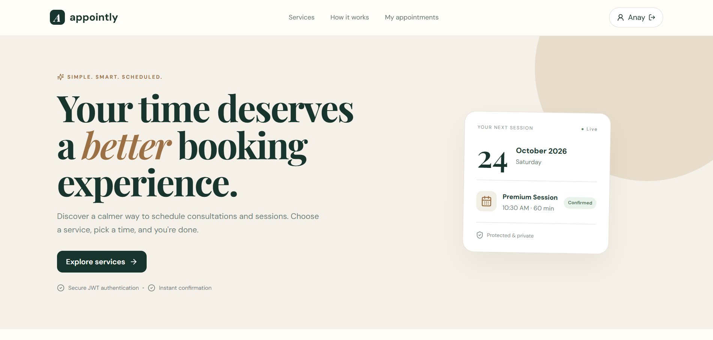
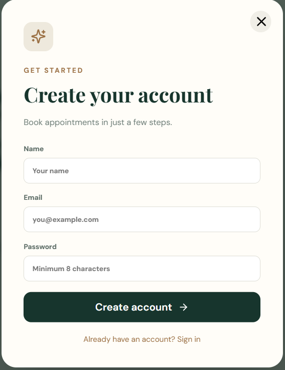
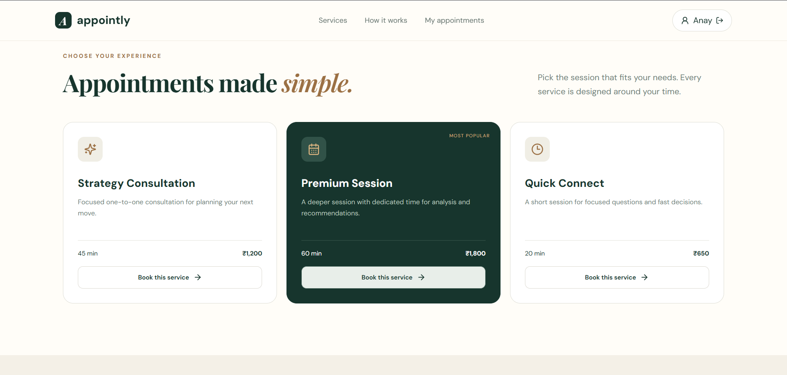
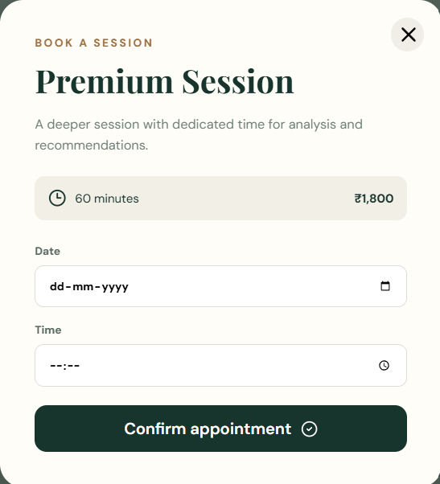
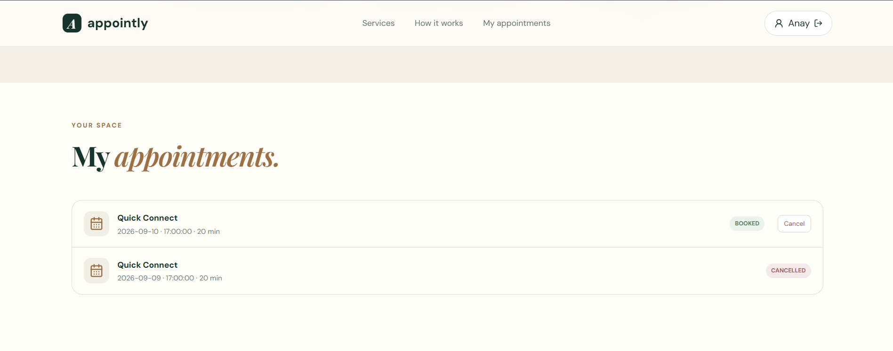

# Appointly Screenshots

This page showcases the main user-facing screens of the Appointly Smart Appointment & Booking System.

## 1. User Dashboard

The dashboard provides users with a simple entry point to the appointment booking system.

---

## 2. User Registration

The registration page allows new users to create an account securely.

---

## 3. Services

Users can browse the services available through the appointment booking platform.

---

## 4. Book an Appointment

Users can select a service and provide the required appointment details through the booking interface.

---

## 5. My Appointments

Users can view their booked appointments and manage their existing bookings.

